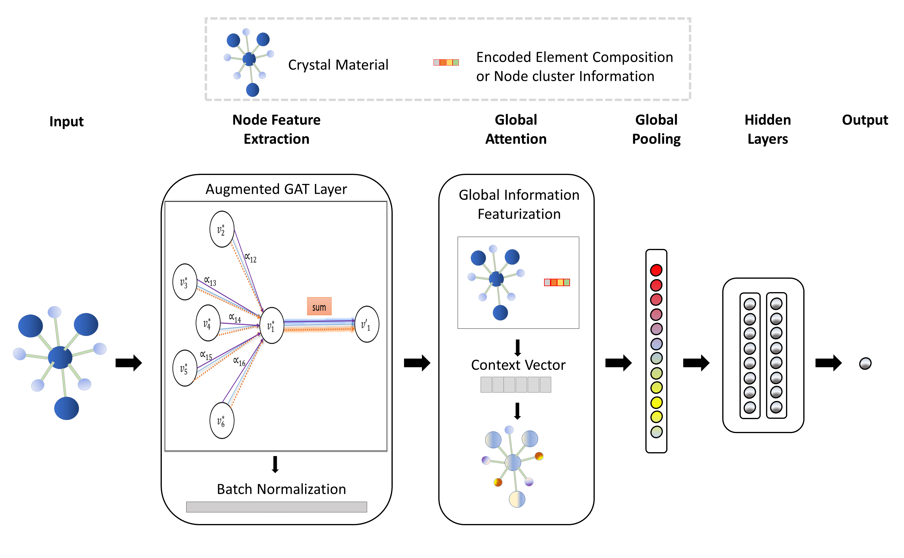

# GATGNN: 全局注意力图神经网络

此软件包实现了我们的GATGNN，用于改进无机材料的属性预测。这是`paddlepaddle`实现的代码库。

## 目录
- [GATGNN: 全局注意力图神经网络](#gatgnn-全局注意力图神经网络)
  - [目录](#目录)
  - [简介](#简介)
  - [安装](#安装)
    - [所需软件包](#所需软件包)
    - [GammaGL修改](#gammagl修改)
  - [数据集](#数据集)
  - [使用方法](#使用方法)
    - [训练新模型](#训练新模型)
    - [评估训练模型的性能](#评估训练模型的性能)
    - [使用CIF文件预测单个无机材料的属性](#使用cif文件预测单个无机材料的属性)
  - [自定义属性和数据集的使用方法](#自定义属性和数据集的使用方法)
  - [官方PyTorch版本](#官方pytorch版本)

## 简介

该软件包提供三个主要功能：

- 训练一个用于任意七种属性的GATGNN模型。
- 评估训练好的GATGNN模型在这些属性上的性能。
- 使用CIF文件预测给定材料的属性。

以下论文描述了我们框架的详细信息：
[基于全局注意力的图卷积神经网络用于改进材料属性预测](https://arxiv.org/pdf/2003.13379.pdf)



## 安装

### 所需软件包

```bash
conda create -n paddle39 python=3.9
conda activate paddle39

pip install --upgrade pip
pip install torch==2.1.2 torchvision==0.16.2 torchaudio==2.1.2 --index-url https://download.pytorch.org/whl/cpu
python -m pip install paddlepaddle-gpu==2.3.2.post116 -f https://www.paddlepaddle.org.cn/whl/linux/mkl/avx/stable.html

pip install git+https://github.com/dddg617/tensorlayerx.git@nightly
pip install pybind11 pyparsing pymatgen

git clone --recursive https://github.com/BUPT-GAMMA/GammaGL.git
cd GammaGL
python setup.py install
```

### GammaGL修改

在GammaGL中修改以下代码：

原始实现：

```python
def unsorted_segment_sum(x, segment_ids, num_segments=None):
    if num_segments is not None:
        assert pd.max(segment_ids) < num_segments
    else:
        num_segments = pd.max(segment_ids) + 1
    if use_ext:
        return paddle_ext.unsorted_segment_sum(x, segment_ids, num_segments)
    idx_ = pd.argsort(segment_ids)
    x = pd.gather(x, idx_)
    segment_ids = pd.gather(segment_ids, idx_)
    output = pd.incubate.segment_sum(x, segment_ids)

    if output.shape[0] == num_segments:
        return output
    else:
        init_output = pd.zeros(shape=[num_segments, x.shape[1]], dtype=output.dtype)
        idx = pd.arange(output.shape[0])
        final_output = _scatter(init_output, idx, output)
        return final_output
```

新的实现：

```python
def unsorted_segment_sum(x, segment_ids, num_segments=None):
    if num_segments is not None:
        assert pd.max(segment_ids) < num_segments
    else:
        num_segments = pd.max(segment_ids) + 1
    if use_ext:
        return paddle_ext.unsorted_segment_sum(x, segment_ids, num_segments)
    
    idx_ = pd.argsort(segment_ids)
    segment_ids = pd.gather(segment_ids, idx_)
    if len(x.shape) > 2:
        res = []
        for i in range(x.shape[0]):
            x_i = pd.gather(x[i], idx_)
            output_i = pd.incubate.segment_sum(x_i, segment_ids)
            if output_i.shape[0] == num_segments:
                res.append(output_i)
            else:
                init_output = pd.zeros(shape=[num_segments, x_i.shape[1]], dtype=output_i.dtype)
                idx = pd.arange(output_i.shape[0])
                final_output = _scatter(init_output, idx, output_i)
                res.append(final_output)
        return pd.stack(res)
    else:
        x = pd.gather(x, idx_)
        output = pd.incubate.segment_sum(x, segment_ids)
        if output.shape[0] == num_segments:
            return output
        else:
            init_output = pd.zeros(shape=[num_segments, x.shape[1]], dtype=output.dtype)
            idx = pd.arange(output.shape[0])
            final_output = _scatter(init_output, idx, output)
            return final_output
```

## 数据集

1. 使用[此链接](https://widgets.figshare.com/articles/12522524/embed?show_title=1)下载我们数据集的压缩文件。
2. 解压其内容（一个名为'DATA'的目录）。
3. 将DATA目录移动到您的GATGNN目录中，使得路径`GATGNN/DATA`现在存在。

## 使用方法

### 训练新模型

满足所有上述要求后，您可以通过在终端中运行`train.py`并附上适当的标志来训练新的GATGNN。至少使用`--property`指定属性和`--data_src`识别数据集（CGCNN或MEGNET）。详细信息可在`runtrain.sh`中找到。

- 示例1：使用CGCNN数据集训练一个关于体积模量属性的模型。
  ```bash
  python train.py --property bulk-modulus --data_src CGCNN
  ```
- 示例2：使用MEGNET数据集训练一个关于剪切模量属性的模型。
  ```bash
  python train.py --property shear-modulus --data_src MEGNET
  ```
- 示例3：使用CGCNN数据集和固定集群解卷积（GI M-2）的全局注意力技术训练一个5层的体积模量模型。
  ```bash
  python train.py --property bulk-modulus --data_src CGCNN --num_layers 5 --global_attention cluster --cluster_option fixed
  ```

训练好的模型将自动保存在TRAINED目录下。*注意使用的标志，因为在评估模型时需要再次使用它们。*

### 评估训练模型的性能

训练GATGNN后，可以使用`evaluate.py`在终端中评估其性能，方法与`train.py`完全相同。*重要的是，运行`evaluate.py`时必须使用与训练时完全相同的标志。*详细信息可在`runtest.sh`中找到。

- 示例1：评估使用CGCNN数据集训练的体积模量模型的性能。
  ```bash
  python evaluate.py --property bulk-modulus --data_src CGCNN
  ```
- 示例2：评估使用MEGNET数据集训练的剪切模量模型的性能。
  ```bash
  python evaluate.py --property shear-modulus --data_src MEGNET
  ```
- 示例3：评估使用CGCNN数据集和固定集群解卷积（GI M-2）的全局注意力技术训练的5层体积模量模型的性能。
  ```bash
  python evaluate.py --property bulk-modulus --data_src CGCNN --num_layers 5 --global_attention cluster --cluster_option fixed
  ```

### 使用CIF文件预测单个无机材料的属性

使用训练好的模型，您可以通过CIF文件预测单个无机材料的属性。请遵循以下步骤：

1. 将您的CIF文件放置在目录`DATA/prediction-directory/`中。
2. 运行`predict.py`，与`evaluate.py`类似，但需添加`--to_predict`标志来指定CIF文件的名称。

- 示例1：使用CGCNN图构建规范预测名为mp-1的材料的体积模量属性。
  ```bash
  python predict.py --property bulk-modulus --data_src CGCNN --to_predict mp-1
  ```
- 示例2：使用MEGNET图构建规范预测名为mp-1的材料的剪切模量属性。
  ```bash
  python predict.py --property shear-modulus --data_src MEGNET --to_predict mp-1
  ```

## 自定义属性和数据集的使用方法

下载并解压数据集后，请遵循以下步骤：

1. 将所有CIF文件放置在目录`DATA/CIF-DATA_NEW`中。
2. 格式化您的CSV属性数据集，使其只有两列（ID，value）。您的文件应类似于我们位于目录`DATA/properties-reference/`中的任何CSV文件。
3. 一旦您的CSV属性数据集格式正确，请将文件重命名为`newproperty.csv`并放置在`DATA/properties_reference/`目录中。

完成这些步骤后，您就可以在自己的数据集上使用我们的GATGNN。要[训练](#使用方法)、[评估](#使用方法)或[预测](#使用方法)您自己的属性，请参考[使用方法](#使用方法)部分中列出的说明。对于`--property`标志、`--data_src`标志和`--train_size`标志，使用`new-property`、`NEW`和任何比例（如0.75）作为值。示例如下：

- 示例1：训练一个新的GATGNN以预测您的属性。
  ```bash
  python train.py --property new-property --data_src NEW --train_size 0.8
  ```
- 示例2：评估在您的属性上训练的模型的性能。
  ```bash
  python evaluate.py --property new-property --data_src NEW --train_size 0.8
  ```
- 示例3：预测名为mp-1的材料的属性值。
  ```bash
  python predict.py --property new-property --data_src NEW --to_predict mp-1
  ```

## 官方PyTorch版本

有关GATGNN的官方PyTorch版本，请访问[GATGNN代码库](https://github.com/superlouis/GATGNN)。

[机器学习与进化实验室](http://mleg.cse.sc.edu)  
计算机科学与工程系

引用：
```bibtex
Louis, Steph-Yves, Yong Zhao, Alireza Nasiri, Xiran Wang, Yuqi Song, Fei Liu, and Jianjun Hu*. "Graph convolutional neural networks with global attention for improved materials property prediction." Physical Chemistry Chemical Physics 22, no. 32 (2020): 18141-18148.
```